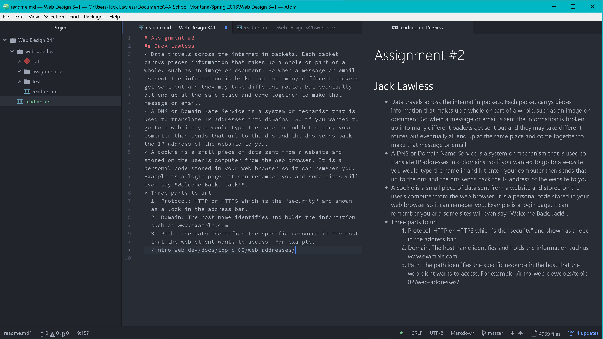

Jack Lawless
# Assignment 2
**What is a Version Control System?** - A VCS allows a devoloper/writer to make changes to a file and track those changes over time. By comitting changes and giving those changes a title or message they can easily track those changes. VCS also allows the users to experiment with things that may or may not work by having the option to go back to previous works. Another reason it is great for this class is that it makes communication, collaboration and sharing fast and efficient, by enabling all connected users to see changes and progress.

[Responses](./images/responses.txt)

**Summary** - This cylce of homework was very interesting. It was intriguing to learn more about the internet, websites and how they work. I am familiar to github and atom from taking Creative Coding 1 last semster, so it made getting set-up a breeze. I am mainly excited to get started with html! I did not have any issues, assuming my link to the responses txt worked. I have kept up on the issues and seems like everyone is helped or figured it out!

