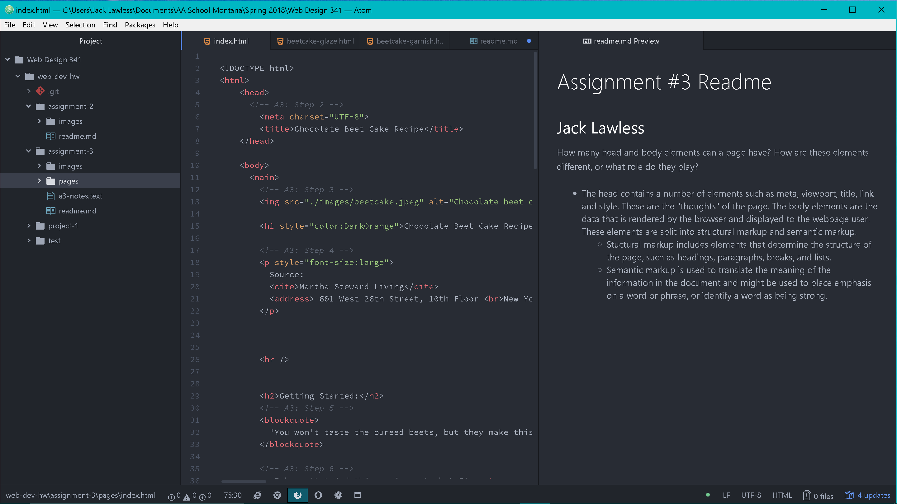

### Jack Lawless
# Web-Dev Assignment #3

* The head contains a number of elements such as meta, viewport, title, link and style. These are the "thoughts" of the page. The body elements are the data that is rendered by the browser and displayed to the webpage user. These elements are split into structural markup and semantic markup.
  * Stuctural markup includes elements that determine the structure of the page, such as headings, paragraphs, breaks, and lists.
  * Semantic markup is used to translate the meaning of the information in the document and might be used to place emphasis on a word or phrase, or identify a word as being strong.

During this week's cycle we got to dive into html and get use to the language. I find the text to be a huge help and very easy to navigate and read. This week's hw was different from what I expected. We finished off a website using instructions, which i found easy to follow. Some of the directions I got confused on but after referencing the text and course webpage I was back on track. I'm more excited to start from scratch and develop more from there.

***

