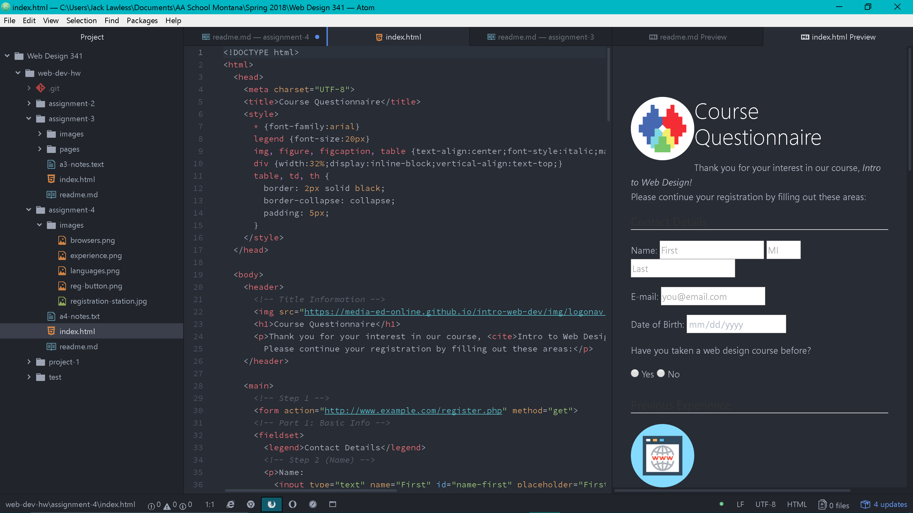

# Assignment #4 Readme
## Jack Lawless
"alt" text is used to provide a text description of an image. When the viewer cannot see the image the "alt" text will be displayed.

Many of the forms I came across on the internet while browser are there for an interaction. By that I mean, forms are there for the user to interact with the webpage by providing feedback in a variety of ways. Such as a textbox for comments, input fields for usernames and passwords, etc. 

This work cycle I enjoyed seeing how forms work. I was interested to see how it worked and now I have a good understanding of it. I didn't seen to run into many issues but when I did I refered back to the textbook or course website and found my answer there. It was nice to learn some CSS I'm definatley excited to dive into both languages more.

