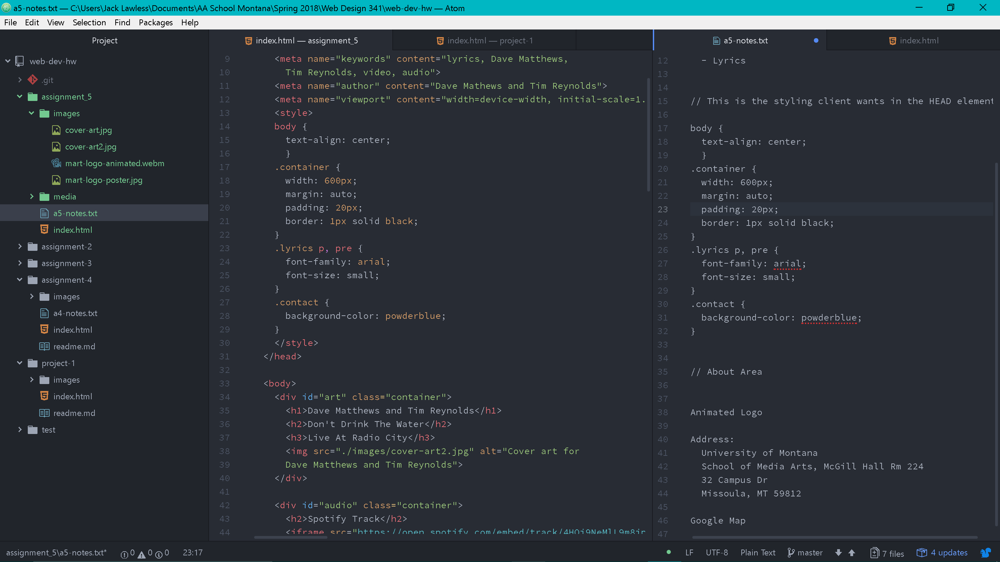

# Intro-Web-Dev Homework
## Jack Lawless
* The *<"div">*  element allows you to group a set of elements together in on block-level.
* The <"span"> element can contain a section of text where there is no other suitable element to differentiate it from its surrounding text, and can contain a number of inline elements.
* ID attribute is used to uniquely identify that element from other elements on the page.
* Class attribute provides several elements as being different from the other elements on the page rather than than uniquely identifying on element as does an ID attribute.

You might consider third-party over self-hosted media due to the time it takes the browser to load the page. Third-party media loads and plays much faster.

This cycle was exciting to dive into. It was exciting to do some more work from scratch. This week introduced a lot more content that filled in the gaps and shed some light on coding all toghether for me. Whenever I ran into issues I refered to the book or course website and resolved the issues that way. I ended up changing my song choice due to the video having restriction and not playing on the webpage. It was an easy change. I'm excited to get into CSS!

