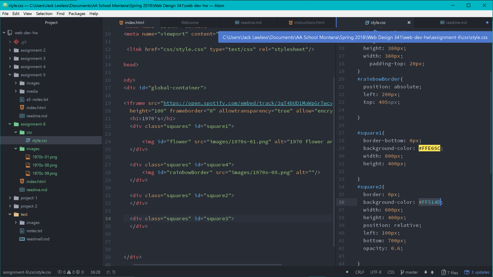

# Intro-Web-Dev Assignment #6 CSS
## Jack Lawless
* For this assignment I picked the 70's for my decade. I then proceeded to research the colors and art of the era and found a 1970's color pallete from adobe kuler and used three of the colors to style my page. I liked how in the example the boxes are overlaying and the opacity is turned down so they blend. I decided to do the same, as well as postioning the provided images to satisfying postions. I wanted to keep it simple with limited room for the eye to wander. My art page I feel encapsules the 1970's.
* The colors are #3144FF,  #FFE65C, and #FF514D.
* I've been waiting to get to this cycle and its all coming together. I was excited to get to finally do some real CSS coding and I did so by following along online and reading the text, I found all the info very useful and referenced the book multiple times. I focused on being able to make items appear how I wanted by playing around with the postion and other attributes of an object.

