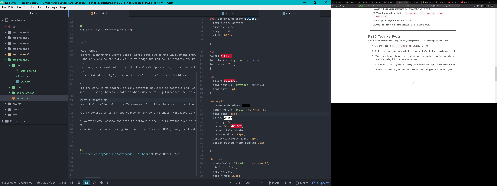

# Intro-Web-Dev Assignment #7 Fonts
## Jack Lawless
* For this assignment I started with putting all my information in my html document so all I had to do after was css/design. I chose fonts that I thought looked spacey/robotic to match the feel of an old school video game. the fonts I chose were Righteous and Roboto.
* System Fonts are fonts that are already installed on your local device/system. Web Fonts are custom fonts hosted on a server and do not need to be on the user's system/device. Web-Safe Fonts are fonts that available by system on Mac and Windows, making them safe for web use. Fallback fonts are important incase a user can not display your first choice it will chose the fallback font. Same Idea applies when having a font stack.
* This cycle I obviously got behind, **(I sent you an email Professor Justine Evans explaining my predicament)** I hadn't realize this assignment was due until the other day, and decided rather than rushing through and getting it handed in it'd be worth my time going throught the lesson as usual. Thankfully there was not a ton of content to learn and gather. I had fun learning how to incorporate fonts in different ways, and this will definatley help with the website I'm working on. Sorry for the super late submission, it was never intended.

