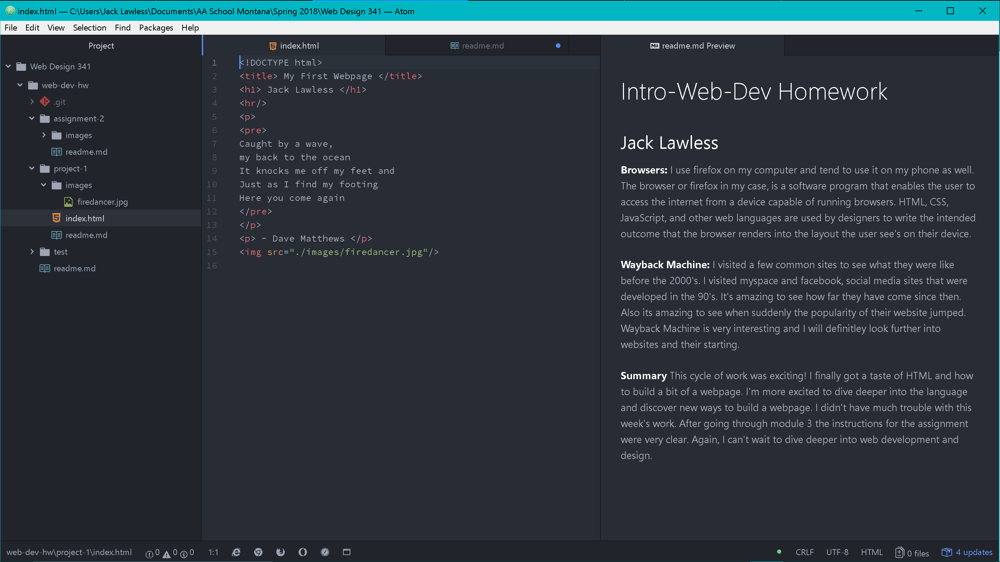

# Intro-Web-Dev Homework
## Jack Lawless
**Browsers:** I use firefox on my computer and tend to use it on my phone as well. The browser or firefox in my case, is a software program that enables the user to access the internet from a device capable of running browsers. HTML, CSS, JavaScript, and other web languages are used by designers to write the intended outcome that the browser renders into the layout the user see's on their device.

**Wayback Machine:** I visited a few common sites to see what they were like before the 2000's. I visited myspace and facebook, social media sites that were developed in the 90's. It's amazing to see how far they have come since then. Also its amazing to see when suddenly the popularity of their website jumped. Wayback Machine is very interesting and I will definitley look further into websites and their starting.

**Summary** This cycle of work was exciting! I finally got a taste of HTML and how to build a bit of a webpage. I'm more excited to dive deeper into the language and discover new ways to build a webpage. I didn't have much trouble with this week's work. After going through module 3 the instructions for the assignment were very clear. Again, I can't wait to dive deeper into web development and design.

